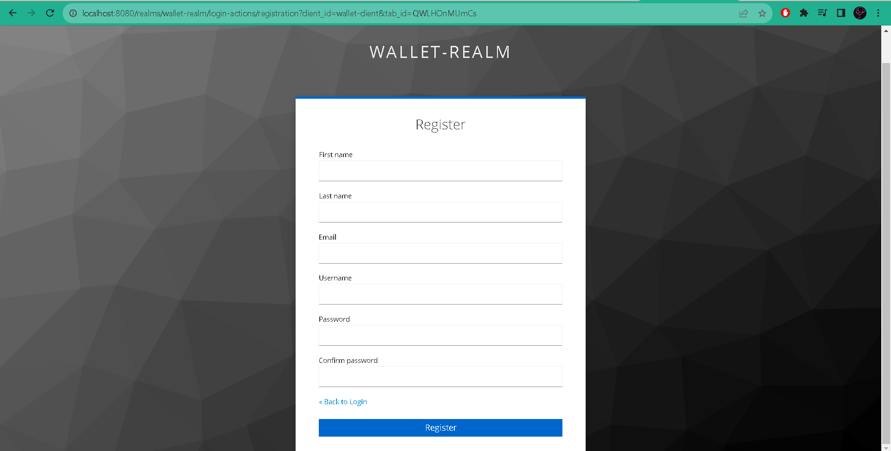
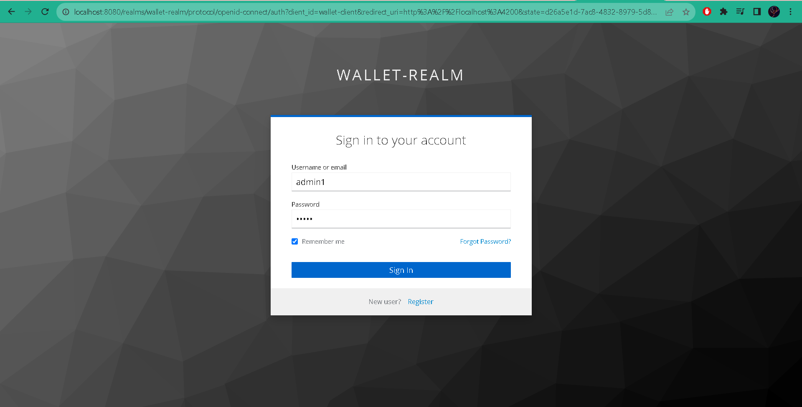
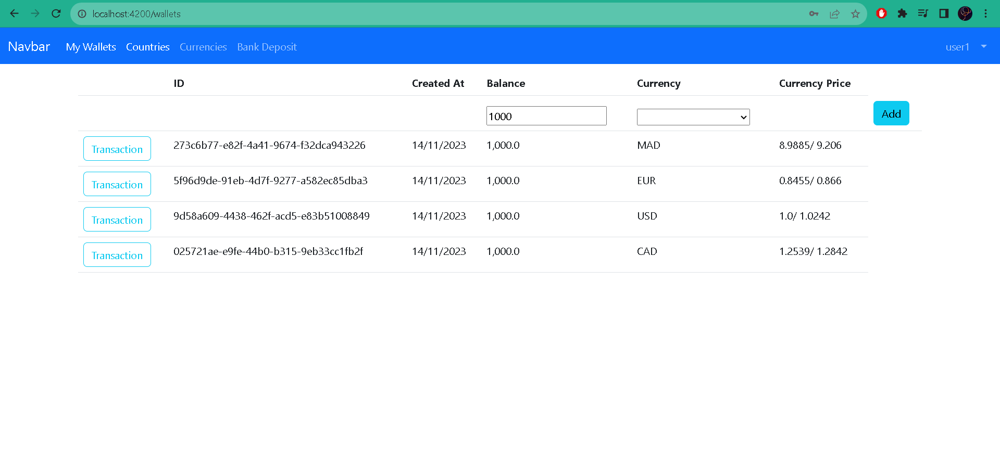

# Ebanking Frontend

<br>

Vous pouvez voir le backend et la configuration du Keycloak <br>
LINK => (https://github.com/oussama-tahri/full-stack-ebanking-secured-keycloak/blob/main/README.md)

<hr>
Pour configurer le front-end on doit premierement ajouter la dependence suivante : <br>

```markdown
npm install --save keycloak-js keycloak-angular
```
<br>
Puis on doit ajouter la fonction kcFactory dans la classe app.module.ts et KeycloakAngularModule dans  **imports**  comme le suivant : <br>

```javascript
export function kcFactory(kcService : KeycloakService) {
  return () => {
    kcService.init({
      config : {
        realm : "wallet-realm",
        clientId : "wallet-client",
        url : "http://localhost:8080"
      },
      initOptions : {
        onLoad : "check-sso",
        checkLoginIframe : true
      }
    })
  }
}
@NgModule({
  declarations: [
    AppComponent,
    NavbarComponent,
    CurrenciesComponent,
    ContinentsComponent,
    WalletsComponent,
    WalletTransactionsComponent,
    CurrencyDepositComponent
  ],
  imports: [
    BrowserModule,
    AppRoutingModule,
    GraphQLModule,
    HttpClientModule,
    ReactiveFormsModule,
    KeycloakAngularModule
  ],
  providers: [{
    provide : APP_INITIALIZER, deps : [KeycloakService],useFactory : kcFactory, multi : true
  }],
  bootstrap: [AppComponent]
})
export class AppModule { }
```

puis on va créer un guard classe dans le dossier guard pour implementer la logique suivante : <br>

```javascript
@Injectable({
  providedIn: 'root'
})
export class AuthGuard extends KeycloakAuthGuard {
  constructor(
    protected override readonly router: Router,
    protected readonly keycloak: KeycloakService
  ) {
    super(router, keycloak);
  }

  public async isAccessAllowed(
    route: ActivatedRouteSnapshot,
    state: RouterStateSnapshot
  ) {
    // Force the user to log in if currently unauthenticated.
    if (!this.authenticated) {
      await this.keycloak.login({
        redirectUri: window.location.origin
      });
    }

    // Get the roles required from the route.
    const requiredRoles = route.data['roles'];

    // Allow the user to proceed if no additional roles are required to access the route.
    if (!Array.isArray(requiredRoles) || requiredRoles.length === 0) {
      return true;
    }

    // Allow the user to proceed if all the required roles are present.
    return requiredRoles.every((role) => this.roles.includes(role));
  }
}
```

et pour les routes : <br>

```javascript
const routes: Routes = [
  {
    path : "currencies", component : CurrenciesComponent
  },
  {
    path : "continents", component : ContinentsComponent
  },
  {
    path : "wallets", component : WalletsComponent, canActivate : [AuthGuard], data : {roles : ['USER']}
  },
  {
    path : "transactions/:walletId", component : WalletTransactionsComponent, canActivate : [AuthGuard], data : {roles : ['USER','ADMIN']}
  },
  {
    path : "currencyDeposit", component : CurrencyDepositComponent, canActivate : [AuthGuard], data : {roles : ['USER','ADMIN']}
  }
];
```

dans cette etape on va configurer la classe security.service.ts :<br>

```javascript
@Injectable({providedIn : "root"})
export class SecurityService {
    public profile? : KeycloakProfile;
    constructor(public kcService : KeycloakService) {
        this.init();
    }

    init() {
        this.kcService.keycloakEvents$.subscribe({
            next:(e) => {
                if(e.type == KeycloakEventType.OnAuthSuccess) {
                    this.kcService.loadUserProfile().then(profile => {
                        this.profile=profile;
                    });
                }
            }
        });
    }

    public hasRoleIn(roles:string[]):boolean {
        let userRoles = this.kcService.getUserRoles();
        for(let role of roles) {
            if(userRoles.includes(role)) return true;
        } return false;
    }
}
```

L'affichage du navbar sera comme le suivant :<br>

```javascript
<ul class="navbar-nav float-end">
        <li class="nav-item">
           <a class="nav-link" *ngIf="securityService.profile; else loginTemplate">
             <a>{{securityService.profile.firstName}}</a>
            </a>

          <ng-template #loginTemplate>
            <a class="btn nav-link" aria-current="page" (click)="login()">Login</a>
          </ng-template>
        </li>

        <li class="nav-item dropdown" *ngIf="securityService.profile">
          <a class="nav-link dropdown-toggle" href="#" role="button" data-bs-toggle="dropdown" aria-expanded="false">
          </a>

          <ul class="dropdown-menu" aria-labelledby="navbarDropdown" >
            <li><a class="dropdown-item" (click)="onLogout()" >Logout</a></li>
            <li><a class="dropdown-item" href="#">Profile</a></li>
          </ul>
        </li>
      </ul>
```

Et pour l'implementation des methodes Login et Logout :<br>

```javascript
onLogout() {
    this.securityService.kcService.logout(window.location.origin);
  }
  public async getToken() {
  }

  async login(){
    await this.securityService.kcService.login({
      redirectUri : window.location.origin
    })
  }
```

## Resultat

<br>

Pour s'enregistrer :
<br>



<br>

Pour s'authentifier :
<br>



<br>

La page du wallet :
<br>

